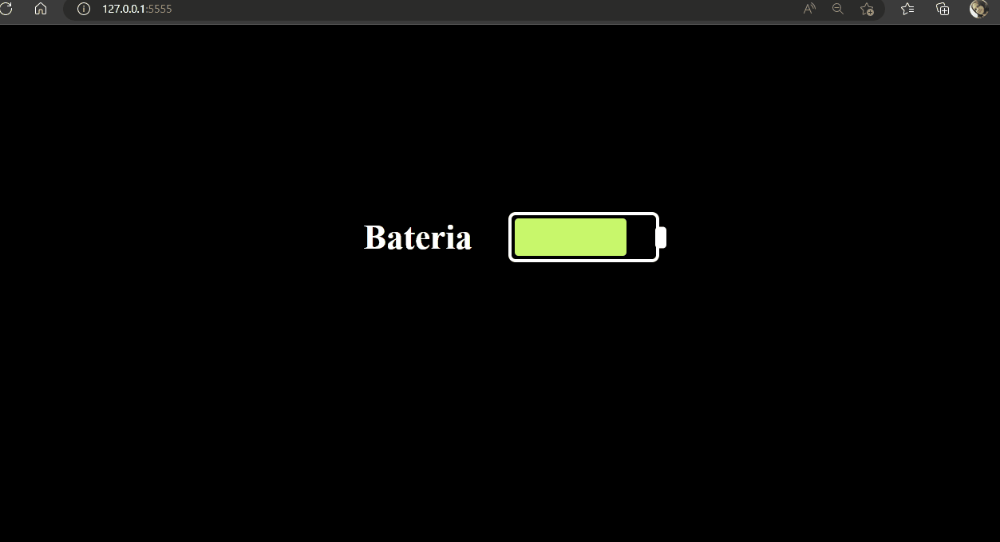
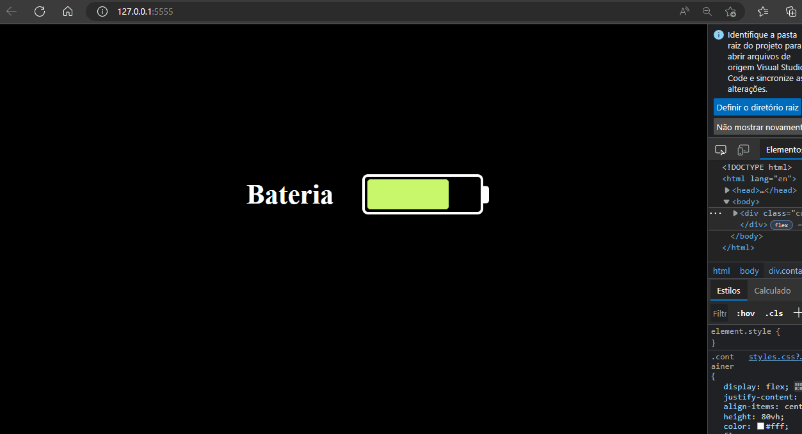

#### Projeto Icon Batterry 🔋

### Projeto desenvolvido 100% individual

### Meus Desafios foram criar o icon batterry, centralizar os elementos tanto no eixo x quanto no eixo y.

### Deixar Responsivo para se adaptar em diferentes tamanhos de tela.

[]

[]

### Tecnologias Utilizadas

 
  

  #### Feito por Márcia